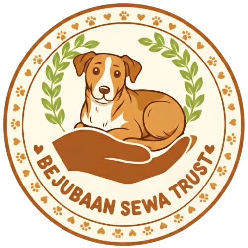
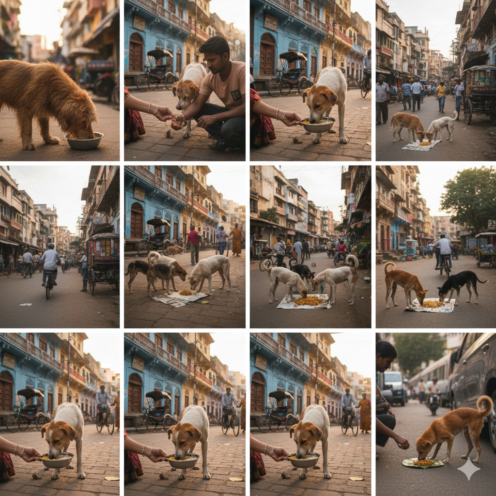
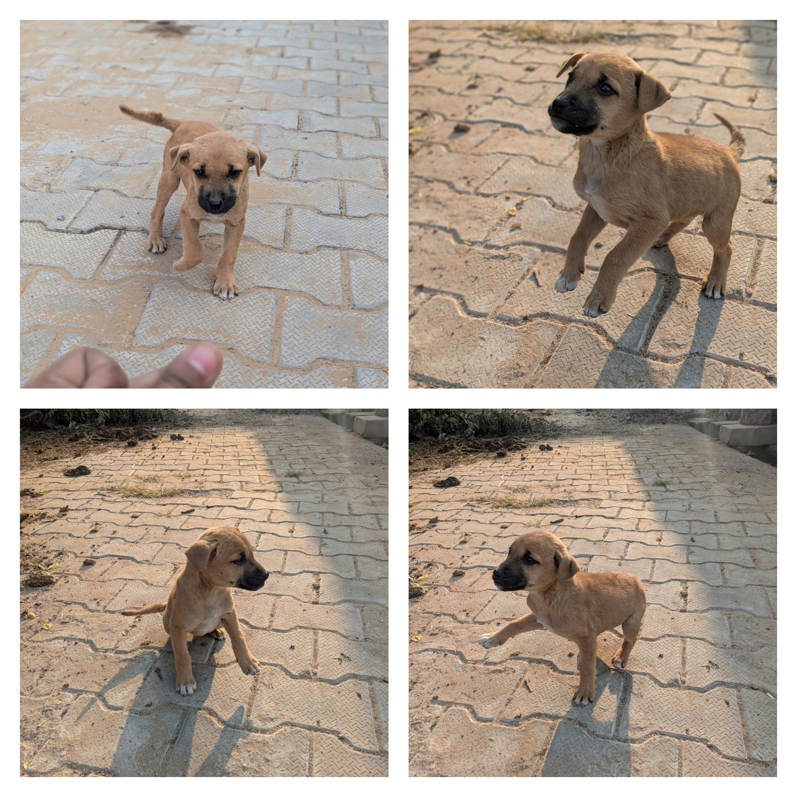

# bejubaansewatrustngo.com
<!DOCTYPE html>
<html lang="en">
<head>
  <meta charset="utf-8" />
  <meta name="viewport" content="width=device-width, initial-scale=1" />
  <title>Bejubaan Seva Trust - Every Paw Deserves Love</title>

  <!-- Tailwind CDN -->
  
  <link href="https://fonts.googleapis.com/css2?family=Poppins:wght@600;700&family=Open+Sans:wght@300;400;600&display=swap" rel="stylesheet">

  
</head>
<body class="antialiased text-gray-800">

  <!-- Header -->
  <header id="siteHeader" class="fixed w-full top-0 left-0 z-50 bg-white/90 backdrop-blur">
    

      <a href="#home" class="flex items-center gap-3">
        
        

          
Bejubaan

          
Seva Trust

        

      </a>

      <!-- Desktop nav -->
      <nav class="hidden md:flex items-center gap-6 text-sm">
        <a href="#home" class="hover:text-orange-500">Home</a>
        <a href="#about" class="hover:text-orange-500">About</a>
        <a href="#volunteer" class="hover:text-orange-500">Volunteer</a>
        <a href="#donate" class="hover:text-orange-500">Donate</a>
        <a href="#gallery" class="hover:text-orange-500">Gallery</a>
        <a href="#contact" class="hover:text-orange-500">Contact</a>
        <a href="https://forms.gle/hjYZnn6HGtC7F7xSA" target="_blank" class="ml-2 px-4 py-2 rounded-full btn-brand text-xs">Register</a>
      </nav>

      <!-- Mobile menu button -->
      <button id="mobileBtn" class="md:hidden text-2xl">☰</button>
    

    <!-- Mobile menu -->
    

      

        <a href="#home" class="py-2">Home</a>
        <a href="#about" class="py-2">About</a>
        <a href="#volunteer" class="py-2">Volunteer</a>
        <a href="#donate" class="py-2">Donate</a>
        <a href="#gallery" class="py-2">Gallery</a>
        <a href="#contact" class="py-2">Contact</a>
      

    

  </header>

  <!-- HERO -->
  <main class="pt-20">
    <section id="home" class="hero-bg h-[520px] md:h-[640px] flex items-center">
      

        

          <h1 class="hero-title text-2xl md:text-4xl font-bold leading-tight">Be Their Hope, Be Their Voice — Join Bejubaan Seva Trust</h1>
          
Love. Feed. Protect. Repeat. We rescue, treat and rehabilitate stray dogs and find loving homes for them.

          

            <a href="#volunteer" class="px-4 py-2 rounded-lg btn-brand">Volunteer Now</a>
            <a href="#donate" class="px-4 py-2 rounded-lg bg-white text-orange-600 font-semibold">Donate Today</a>
            <a href="#gallery" class="px-4 py-2 rounded-lg bg-white/20 border border-white/30">See Gallery</a>
          

          

            

20+

Active Volunteers

            

30+

Dogs Fed Monthly

          

        

      

    </section>

    <!-- ABOUT -->
    <section id="about" class="py-16 bg-white">
      

        

          

            <h2 class="text-3xl font-bold text-orange-600 mb-4">About Bejubaan Seva Trust</h2>
            
Bejubaan Seva Trust is a community-driven NGO working for the welfare of street dogs. We rescue injured animals, provide medical care, arrange adoptions, and run community feeding programs.

            <ul class="space-y-2 text-sm text-gray-600">
              <li>• Community feeding programs</li>
            </ul>

            

              <a href="#volunteer" class="btn-brand px-4 py-2 rounded">Join as Volunteer</a>
              <a href="#donate" class="px-4 py-2 rounded border border-orange-200">Donate</a>
            

          

          

            
          

        

      

    </section>
      <!-- Volunteer Modal -->
     <section id="volunteer" class="py-16 bg-orange-50">
         

           <h2 class="text-2xl font-bold mb-4">Become a Volunteer</h2>
            
Fill out our official Volunteer Google Form.

           <a href="https://forms.gle/hjYZnn6HGtC7F7xSA"
             class="btn-brand px-5 py-3 rounded-lg text-lg"
             target="_blank">
      Open Volunteer Form
    </a>
  

     </section>

    <!-- DONATE -->
     <section id="donate" class="py-16 bg-white">
      <h3 class="text-xl font-bold mb-3">
Scan & Pay (UPI)
</h3>

      

      

        
 Works on PhonePe, Google Pay, Paytm & all UPI apps.

       
      

    

  

</section>

    <!-- GALLERY -->
    <section id="gallery" class="py-16 bg-orange-50">
      

        <h2 class="text-3xl font-bold text-center text-orange-600 mb-8">Gallery</h2>
        

          
          
         <!----
          
          
          -->
        

      

      <!-- Lightbox Modal -->
      

        

        

          
          <button id="closeLightbox" class="absolute top-2 right-2 bg-white/80 rounded-full p-2">✕</button>
        

      

    </section>

    <!-- CONTACT -->
    <section id="contact" class="py-16 bg-white">
      

        <h2 class="text-3xl font-bold text-center text-orange-600 mb-6">Contact Us</h2>
        

          

            
<strong>Email:</strong> bejubaansewat@gmail.com

            
<strong>Phone / WhatsApp:</strong> +91-7291955060

            
<strong>Address:</strong> (Add your city/local address here)

            

              <a href="https://www.instagram.com/bejubaansewa/#" target="_blank"
   style="display:inline-flex; align-items:center; gap:10px; 
          padding:10px 18px; background:#E1306C; color:white; 
          border-radius:10px; text-decoration:none; font-size:18px;">
   
   Instagram
</a>
<a href="https://www.facebook.com/Bejubaansewa/#" target="_blank"
   style="display:inline-flex; align-items:center; gap:10px; 
          padding:10px 18px; background:#1877F2; color:white; 
          border-radius:10px; text-decoration:none; font-size:18px;">
   
   Facebook
</a>

            <!---- <a href="https://www.youtube.com/@" target="_blank"
   style="display:inline-flex; align-items:center; gap:10px; 
          padding:10px 18px; background:#FF0000; color:white; 
          border-radius:10px; text-decoration:none; font-size:18px;">
   
   YouTube
</a>-->

            

          

          <form id="contactForm" class="bg-orange-50 p-6 rounded-lg">
            <input name="name" placeholder="Name" class="w-full p-2 mb-3 rounded border" required>
            <input name="email" placeholder="Email" class="w-full p-2 mb-3 rounded border" required>
            <textarea name="message" placeholder="Message" class="w-full p-2 mb-3 rounded border" rows="4" required></textarea>
            <button type="submit" class="w-full btn-brand py-2 rounded">Send Message</button>
            
Message sent. We'll contact you soon.

          </form>
        

      

    </section>

    <!-- Footer -->
    <footer class="bg-orange-500 text-white py-6">
      

        
Follow us: Instagram | Facebook | YouTube

        
&copy; 2025 Bejubaan Seva Trust. Made with ❤️

      

    </footer>

  </main>

  <!-- Floating WhatsApp -->
  

  <!-- Scripts -->
  
</body>
</html>
